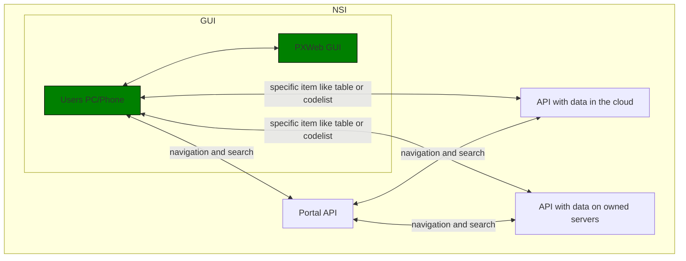
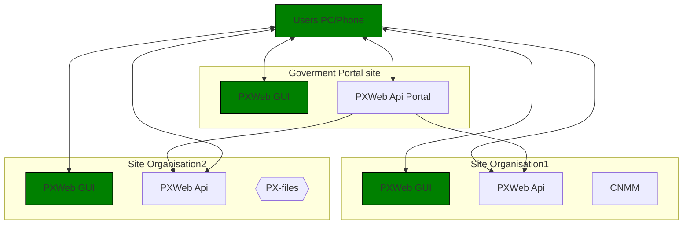

The portal api just aggregates data from other apis.  

PxWeb 2 runs on the users device. So the calls to the apis are made from the device.
The links in the respones from the portal api will point back to the portal api for folders i.e. the menu, but for other things like table data it will point directly to the underlying api.   

Inside one organisation, some data may be in the cloud and some on owned servers. 

Another senario is: The government want a site with data from many organisations. The organisations will have separate sites with their own PxWeb

      
       
     
