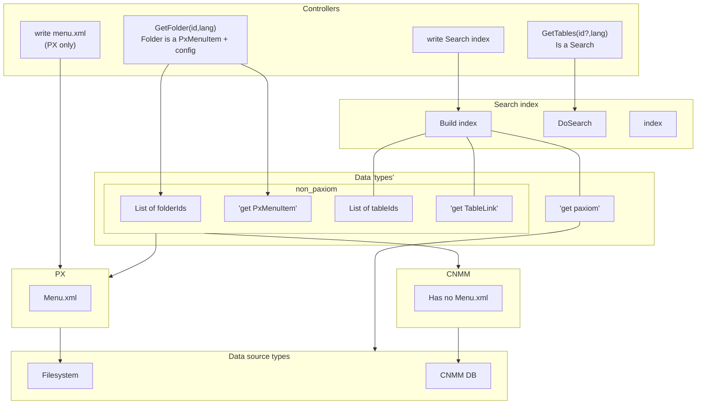

Drawing of things for the menu

```mermaid
flowchart TB
    a1-->d1
    a1-->d4
    a2-->b2
    a3-->b3
    b2---d3
    b2---d2
    b2---d5    

    subgraph one[Controllers]
    direction LR
    a1["GetFolder(id,lang)"\nFolder is a PxMenuItem + config]
    a3["GetTables(id?,lang)\nIs a Search"]
    a2["write Search index"] 
    a4["write menu.xml\n(PX only)"]
    end

    subgraph two["Search index"]
      b2["Build index"]
      b1["index"]
      b3["DoSearch"]
    end
    
    subgraph sg5["Data 'types'"]
        subgraph non_paxiom
        d1["List of folderIds"]
        d2["List of tableIds"]
        d4["'get PxMenuItem'"]
        d5["'get TableLink'"]
        end

        d3["'get paxiom'"]
    end

    subgraph sg6["PX"]
        px["Menu.xml"]
    end

    subgraph sg7["CNMM"]
        cnmm["Has no Menu.xml"]
    end

    subgraph sg16["Data source types"]
    sg16_21["Filesystem"]
    sg16_22["CNMM DB"]
    end
    a4-->sg6
    non_paxiom-->sg6
    non_paxiom-->sg7
    sg7-->sg16_22
    sg6-->sg16_21
    d3-->sg16
```

